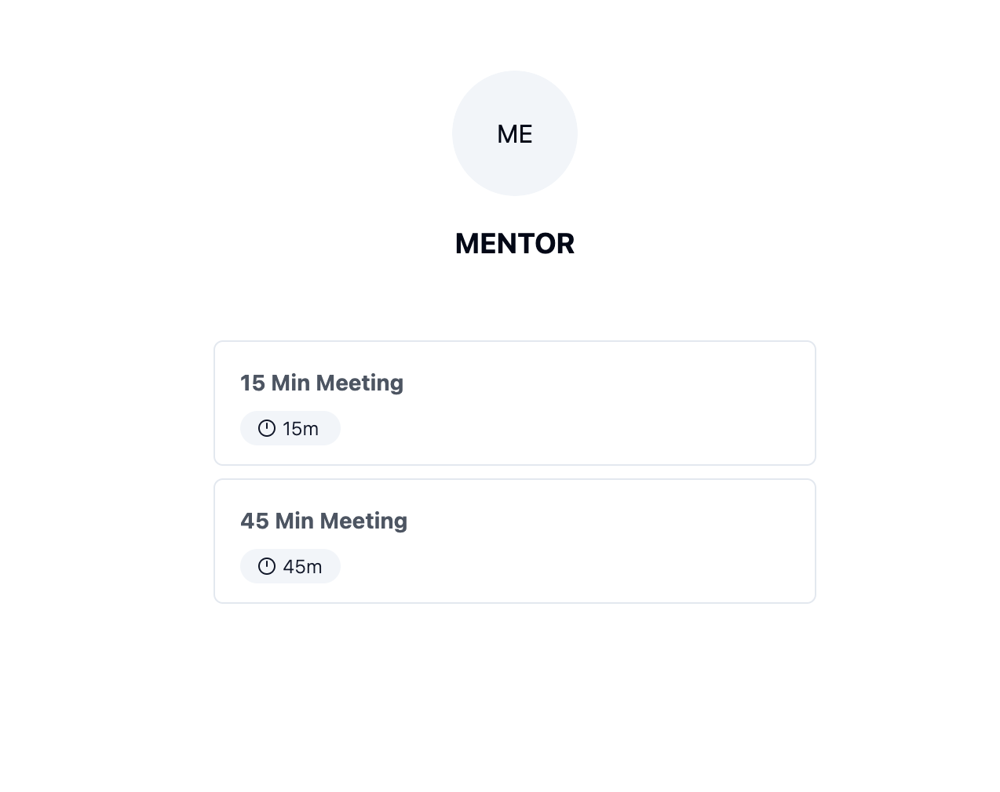
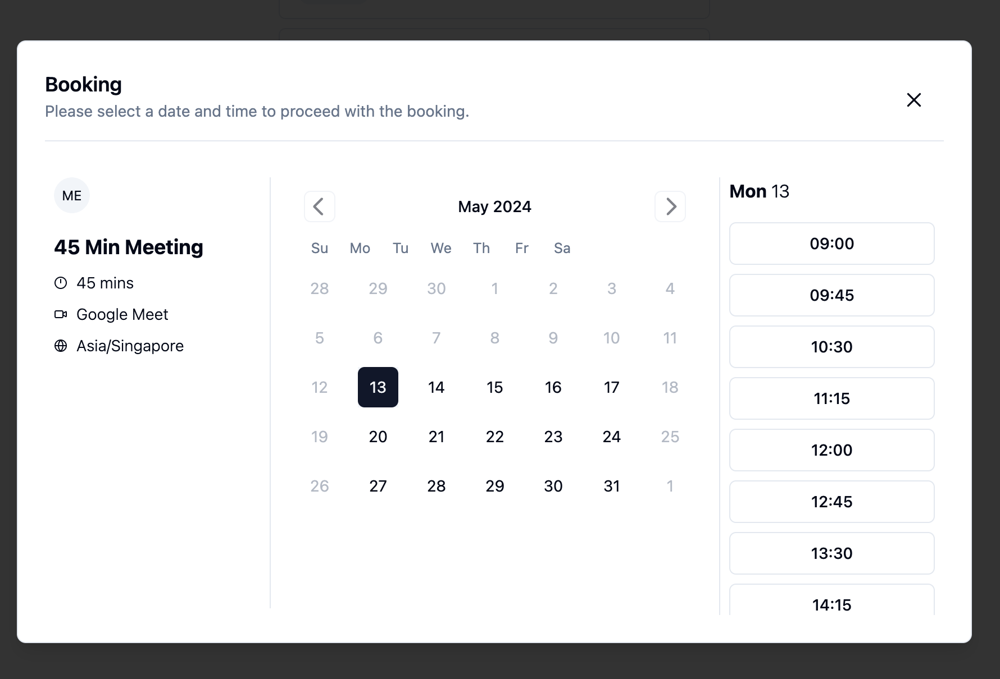
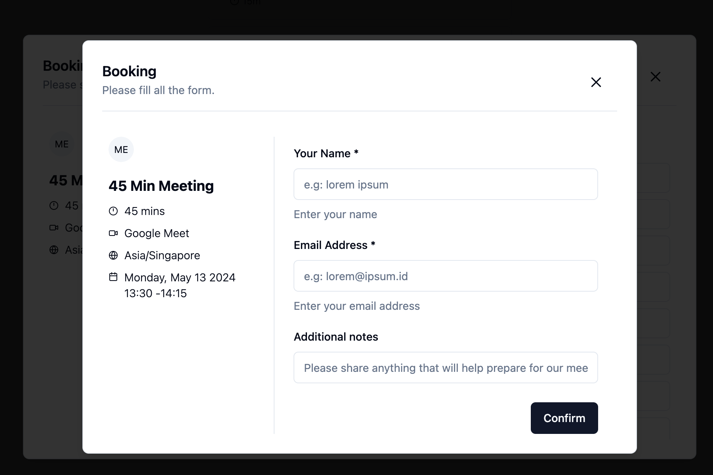

# Sample Google Calendar, Meet & OAuth Integration

 
 
 

### Config:

1. copy `google.sample.json` to `google.json` get all the credential from [google console ](https://console.cloud.google.com/apis/credentials)
2. run build frontend dist `make build-fe`
3. run app `make run`

### Available User:

1. mentor
2. mentee

all user's password is `secret`
